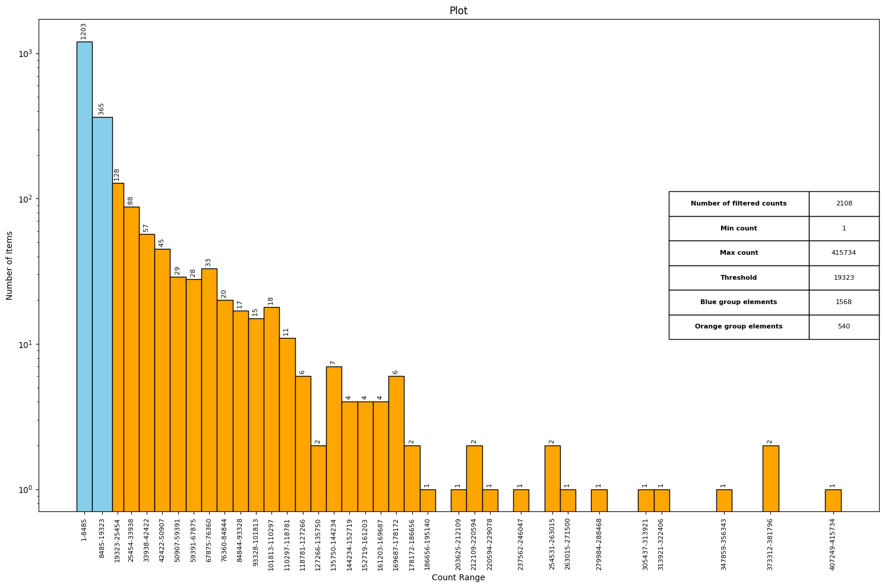
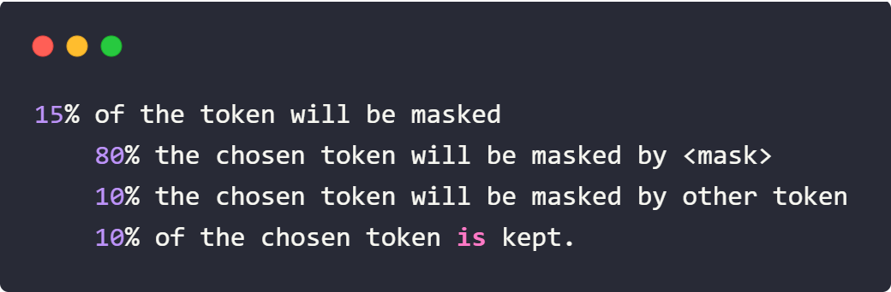
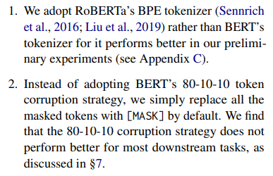
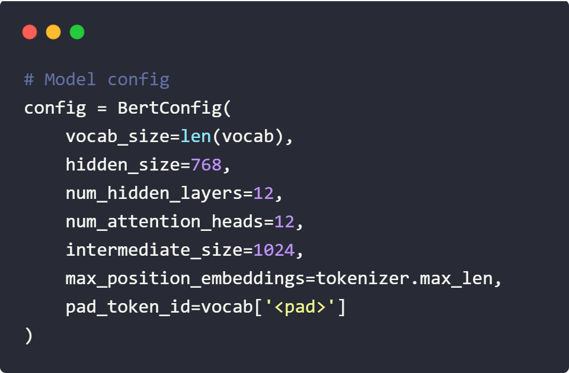
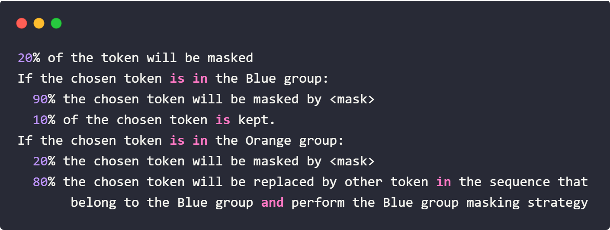
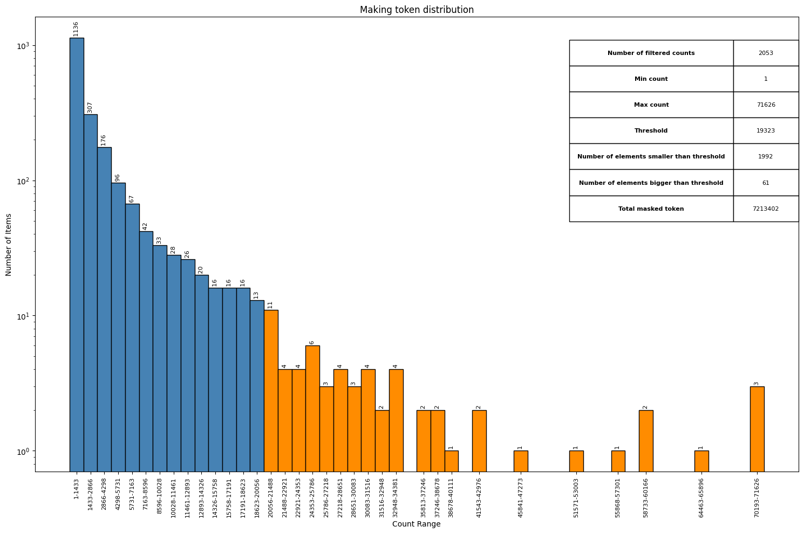
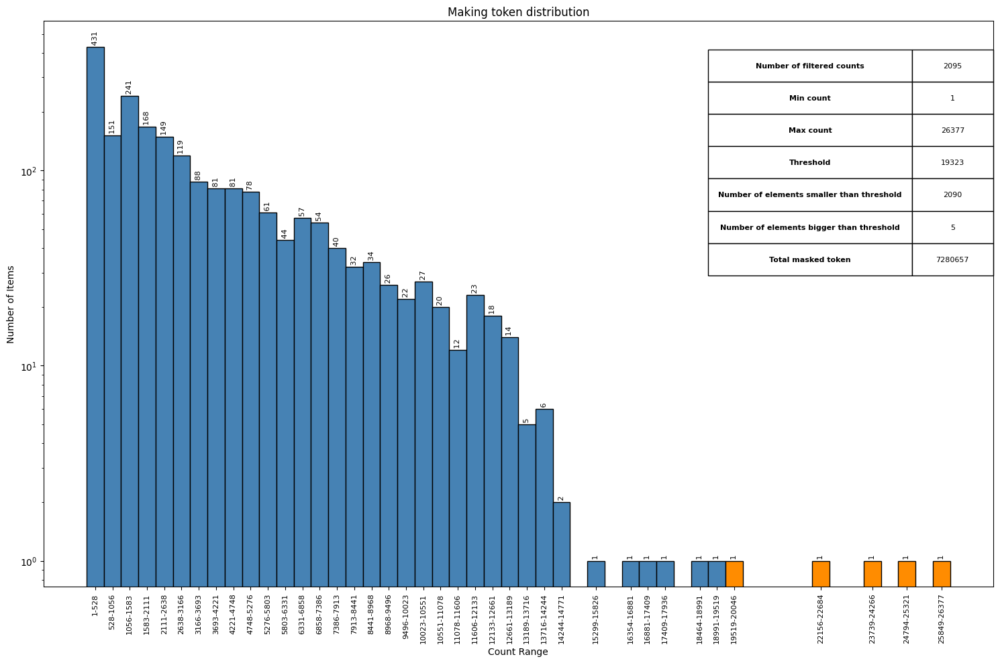
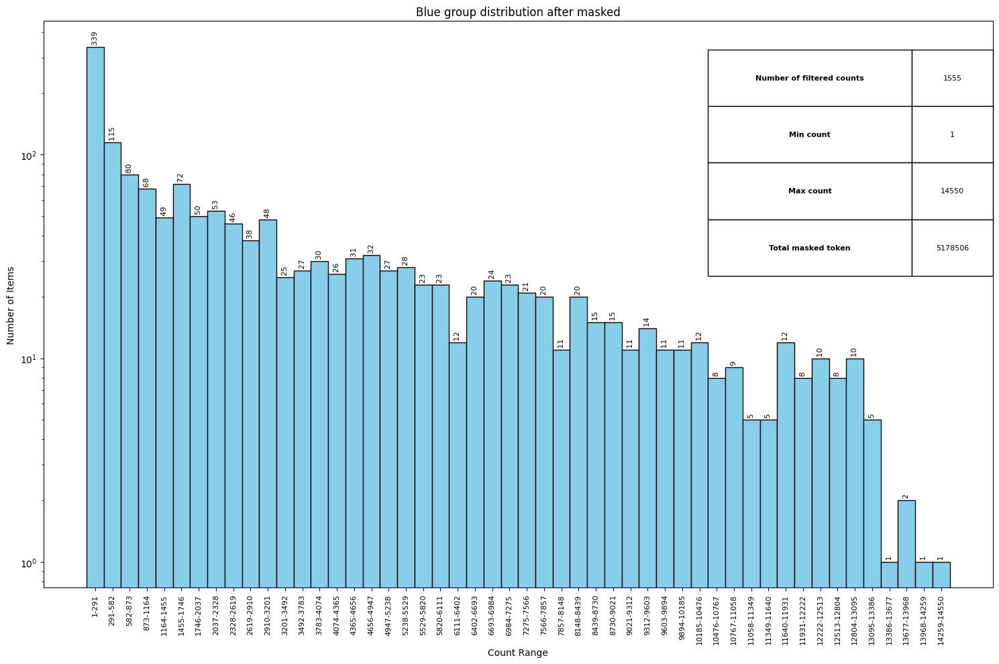
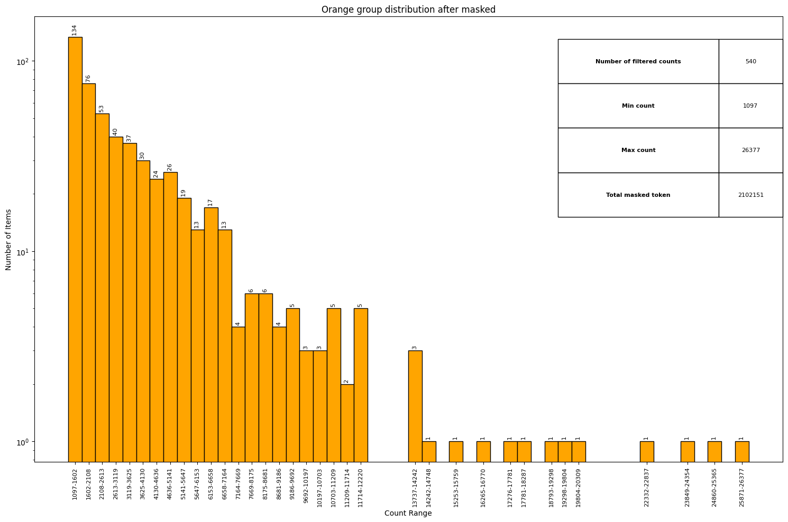
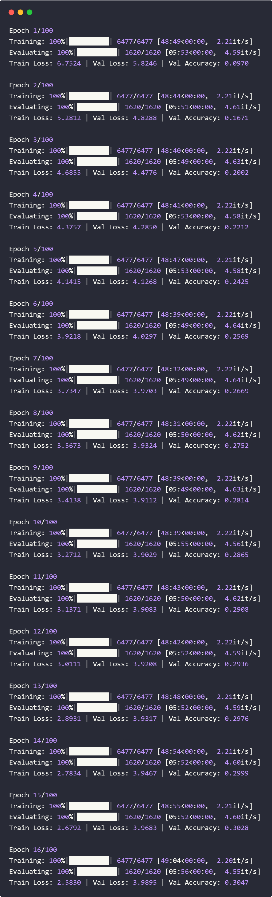

# Repo purpose

In this repo, we will train a Masked Language model which will be used for our fine-tuned task later. We will regard the masking strategy of the BERT model and custom it to alleviate the screwed distribution of the training set.  

# Word distribution of the Training set

Our data contains about 4 million sequences with 2108 unique words, thus, each word will likely occur in many sequences and thus the model may learn a lot about each word. However, one problem occur as these distribution is not equally distributed, that is in may occur a lot while an other not

The image shows the word distribution. In the figure, most of the words occur frequently (with the highest appearing more than 400 thousand times) while half of the words only occur less than 10 thousand times. With about 4 million words, we have about 40733364 million words used, with the number of unique words being 21018. Thus, each may be expected to occur about 19323 times. However, as you can see in the image, the distribution is not equally distributed as some occur up to hundreds thousands of times, while many many others not to 10000 times.

With this unstable distribution, the Masking task trained for the model may not be efficient as only some words are learned repeatedly while others not. Thus, instead of using the masking strategy in the BERT paper, we will customize the masking strategy such that the masking token distribution is more stable.

# Custom Masking Strategy

Let’s call the set of unique words in the dataset a unique set. The unique set has 2108 unique elements, we divided them into two groups, one with a number of occurrences less than the threshold - 19323 and other occurrences more than 19323, which we call the Blue group and Orange group respectively.

Currently, the masking algorithm are using as below:

From the paper [Should You Mask 15% in Masked Language Modeling?](https://aclanthology.org/2023.eacl-main.217.pdf), we simply mask all the masked tokens by <mask>. And also, we increase the number of masking tokens in each sequence to 20%.

  

The model config we will use is the Base BERT model:

  

We custom the masking by: every time the token is masked, we will check if the token belongs to the Blue or Orange group. If the token belongs to the Blue group, we perform the masking as normal. If the token is in the Orange group, we will do the masking for other tokens that belong to the Blue group in that sequence with the probability of 60~80%. The masking strategy will look like.

  

# Result of the masking strategy

The below image show the token distribution of BERT masking strategy and custom masking strategy:

  

<em>BERT masking strategy token distribution</em>

  

<em>Custom masking strategy token distribution</em>

Notice that the shaded blue is the frequency of words occurring less than the threshold - 19323 and vice versa for the shaded orange. Notice that, this time, the highest number of times one token occurs is only 26337 which with default masking strategy is. Beside that, the number of token in Blue group have increase compare to number of token in the Orange group

  

<em>Blue group distribution after masked</em>

  

<em>Orange group distribution after masked</em>

# Result of the Fine tune strategy:

Even though we have done custom Masking strategy, we haven't made a significant improvement in model performance on masking tasks, more precisely, we have improved the accuracy to 30% and got stuck at this. And as well, we get a overfit problem as the training loss decrease and the validation loss decrease.

  

<em>Training result with first 16 epoch</em>

We stop the training as the model get the overfit signs

# Reason (hypothesis):

One reason we think about is the characteristics of the training set. We use poem training set to train the model for Masking task which somehow not efficiently as the poem will have length about 5 to 10 words and we masked about 20% of them will cause the lacking context for the masking words. So instead of generalize the words, it overfit with the training pattern.